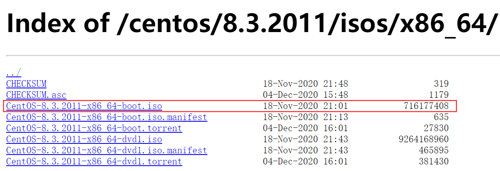
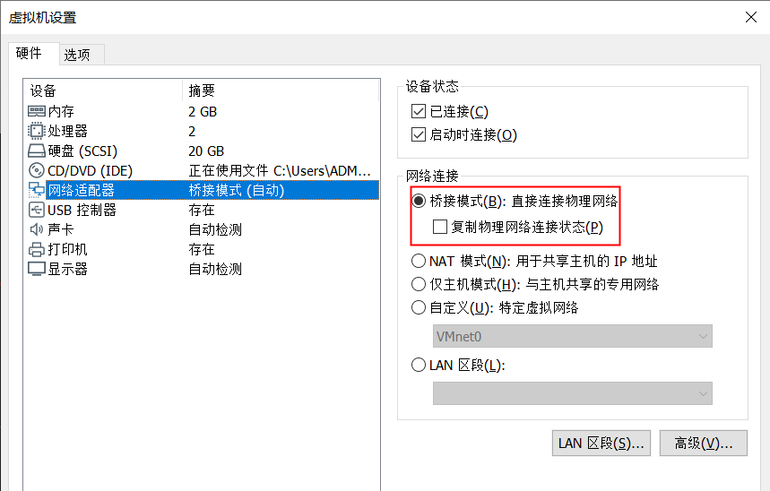
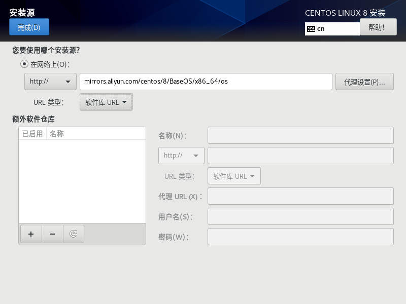
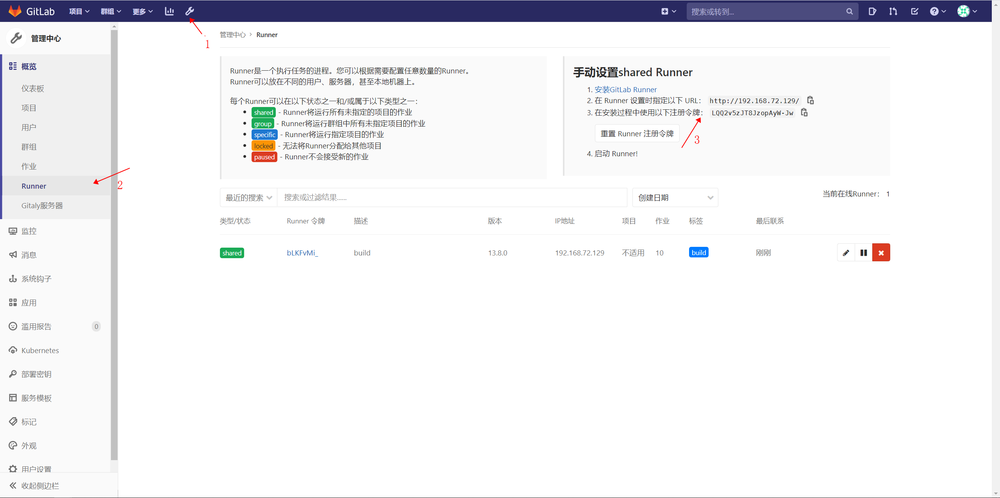
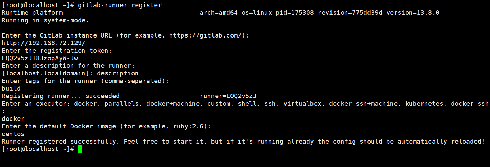
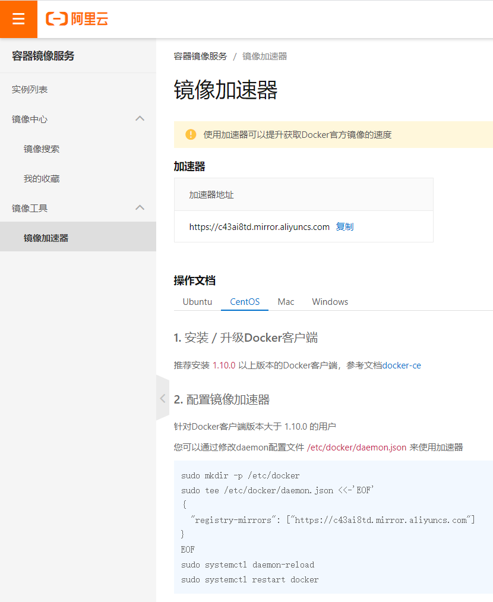

# GitLab CI/CD

实现通过在 Gitlab 上新增 tag 的方式，自动生成镜像，并推送至阿里云镜像仓库。

## 一、 环境准备

1. 安装 centos 8

   下载 centos  8 镜像。 http://mirrors.aliyun.com/centos/8.3.2011/isos/x86_64/

   

   vmware 安装 centos 8。注意选择桥接模式，否则可能会出现宿主机ping不通虚拟机的情况

   

   CentOS8通过引导盘+网络镜像镜像源安装系统，设置网络镜像安装源为：

   mirrors.aliyun.com/centos/8/BaseOS/x86_64/os
   

2. 安装 gitlab-ce

   安装依赖并开启防火墙

   ```shell
   sudo dnf install -y curl policycoreutils openssh-server perl
   sudo systemctl enable sshd
   sudo systemctl start sshd
   # Check if opening the firewall is needed with: sudo systemctl status firewalld
   sudo firewall-cmd --permanent --add-service=http
   sudo firewall-cmd --permanent --add-service=https
   sudo systemctl reload firewalld
   ```

   开启邮件服务

   ```shell
   sudo dnf install postfix
   sudo systemctl enable postfix
   sudo systemctl start postfix
   ```

   下载 gitlab-ce 软件包

   https://mirrors.tuna.tsinghua.edu.cn/gitlab-ce/yum/el8/

   ```shell
   yum install -y wget
   wget https://mirrors.tuna.tsinghua.edu.cn/gitlab-ce/yum/el8/gitlab-ce-12.10.0-ce.0.el8.x86_64.rpm
   ```

   安装gitlab的依赖

   ```shell
   yum install -y policycoreutils-python-utils
   ```

   安装gitlab-ce

   ```shell
   rpm -i gitlab-ce-12.10.0-ce.0.el8.x86_64.rpm
   ```

   编辑ip和端口

   ```shell
   vim /etc/gitlab/gitlab.rb
   
   external_url 'http://[ip]:[port]/'
   ```

   重启配置和服务

   ```shell
   gitlab-ctl reconfigure
   gitlab-ctl restart
   ```

   这时用宿主机在网页上输入刚才定义的路径即可进入打开 gitlab。

   第一次进入需要修改 root 密码。

3. 安装 gitlab-runner

   [清华园 GItlab Runner帮助文档地址](https://mirrors.tuna.tsinghua.edu.cn/help/gitlab-runner/)

   推荐将runner和gitlab分别安装在不同的机器上。

   ```shell
   vim /etc/yum.repos.d/gitlab-runner.repo
   
   [gitlab-runner]
   name=gitlab-runner
   baseurl=https://mirrors.tuna.tsinghua.edu.cn/gitlab-runner/yum/el$releasever-$basearch/
   repo_gpgcheck=0
   gpgcheck=0
   enabled=1
   gpgkey=https://packages.gitlab.com/gpg.key
   ```

   执行

   ```shell
   sudo yum makecache
   sudo yum install gitlab-runner
   ```

   检查是否安装成功

   ```shell
   gitlab-runner -v
   ```

4. 注册 runner

   runner 有三种类型的，我们这里注册一个全局的 runner。

   

   找到对应的 url 和 token

   注意类型选择 shell 可以使用宿主机的指令。选择 docker 类型需要确保 runner 能连接 docker 服务。

   在虚拟机上运行

   ```shell
   gitlab-runner register
   ```

   

5. 安装 docker

   安装需要的软件包， yum-util 提供yum-config-manager功能，另外两个是devicemapper驱动依赖的

   ```shell
   yum install -y yum-utils device-mapper-persistent-data lvm2
   ```

   设置yum源，官方太慢，用阿里云的

   ```shell
   yum-config-manager --add-repo http://mirrors.aliyun.com/docker-ce/linux/centos/docker-ce.repo
   ```

   安装 docker 

   ```shell
   yum install docker-ce
   ```

   设置镜像仓库源为阿里镜像仓库

   

   ```shell
   mkdir -p /etc/docker
   tee /etc/docker/daemon.json <<-'EOF'
   {
     "registry-mirrors": ["https://c43ai8td.mirror.aliyuncs.com"]
   }
   EOF
   systemctl daemon-reload
   systemctl restart docker
   ```

   安装完成后检查 docker 是否安装好

   ```shell
   [root@localhost docker]# docker version
   Client: Docker Engine - Community
    Version:           20.10.3
    API version:       1.41
    Go version:        go1.13.15
    Git commit:        48d30b5
    Built:             Fri Jan 29 14:33:08 2021
    OS/Arch:           linux/amd64
    Context:           default
    Experimental:      true
   
   Server: Docker Engine - Community
    Engine:
     Version:          20.10.3
     API version:      1.41 (minimum version 1.12)
     Go version:       go1.13.15
     Git commit:       46229ca
     Built:            Fri Jan 29 14:31:25 2021
     OS/Arch:          linux/amd64
     Experimental:     false
    containerd:
     Version:          1.4.3
     GitCommit:        269548fa27e0089a8b8278fc4fc781d7f65a939b
    runc:
     Version:          1.0.0-rc92
     GitCommit:        ff819c7e9184c13b7c2607fe6c30ae19403a7aff
    docker-init:
     Version:          0.19.0
     GitCommit:        de40ad0
   ```

   安装 npm

   ```shell
   yum install -y npm
   ```

   检查 npm 是否安装成功

   ```shell
   [root@localhost docker]# npm -v
   6.14.4
   ```

## 二、编写相关文件

到目前为止我们安装了 gitlab，gitlab-runner，docker，node。下面我们编写 .gitlab-ci.yml、nginx.conf、Dockerfile 脚本实现自动化构建。

```yml
# .gitlab-ci.yml

stages:
  - node_build
  - docker_build

node_build:
  stage: node_build
  only:
    - tags
  script:
    - npm install --registry=https://registry.npm.taobao.org
    - npm run build
    - ls
  tags:
    - shell
  artifacts:
    paths:
      - dist/

docker_build:
  stage: docker_build
  only:
    - tags
  dependencies:
    - node_build
  script:
    - BUILD_TAG=$CI_COMMIT_TAG
    - docker version
    - docker login -u $DOCKER_USERNAME -p $DOCKER_PASSWORD registry.cn-beijing.aliyuncs.com
    - ls
    - docker build -t cms-template:$BUILD_TAG .
    - IMAGE_ID=$(docker images | grep cms-template | grep $BUILD_TAG | awk '{print $3}')
    - docker tag $IMAGE_ID registry.cn-beijing.aliyuncs.com/aimer-fan/cms-template:$BUILD_TAG
    - docker push registry.cn-beijing.aliyuncs.com/aimer-fan/cms-template:$BUILD_TAG
    - docker rmi -f $IMAGE_ID
  tags:
    - shell

```

```nginx
# nginx.conf

user  nginx;
worker_processes  1;
error_log  /var/log/nginx/error.log warn;
pid        /var/run/nginx.pid;
worker_rlimit_nofile 20480;


events {
  use epoll;
  worker_connections 20480;
  multi_accept on;
}

http {
    include       /etc/nginx/mime.types;
    default_type  application/octet-stream;

    log_format  main  '$remote_addr - $remote_user [$time_local] "$request" '
                      '$status $body_bytes_sent "$http_referer" '
                      '"$http_user_agent" "$http_x_forwarded_for"';
    #请求量级大建议关闭acccess_log
    #access_log  /var/log/nginx/access.log  main;

    #fastcgi_intercept_errors on;
    #proxy_intercept_errors on;
    #error_page 404 /data/web/404.html;
    sendfile        on;
    #tcp_nopush     on;

    keepalive_timeout  65;

    gzip on;
    gzip_min_length 1k;
    gzip_buffers 4 16k;
    gzip_types application/javascript application/json;

    include /etc/nginx/conf.d/*.conf;
    add_header Access-Control-Allow-Origin *;
    add_header Access-Control-Allow-Methods 'GET, POST, OPTIONS';
    add_header Access-Control-Allow-Headers 'DNT,X-Mx-ReqToken,Keep-Alive,User-Agent,X-Requested-With,If-Modified-Since,Cache-Control,Content-Type,Authorization';
    
    server {
        listen 80;
        root /workspace/web;
        charset utf-8;
        client_max_body_size 75M;
        location / {
            # root /usr/share/nginx/html;
            index /index.html;                        
            try_files $uri $uri/ /index.html;        #匹配不到任何静态资源，跳到同一个index.html
        }
    }
}
```

```dockerfile
FROM nginx:alpine

RUN mkdir -p /workspace/web

WORKDIR /workspace/web

COPY ./dist/ /workspace/web/
COPY nginx.conf /etc/nginx/nginx.conf

CMD nginx -g 'daemon off;'
```

