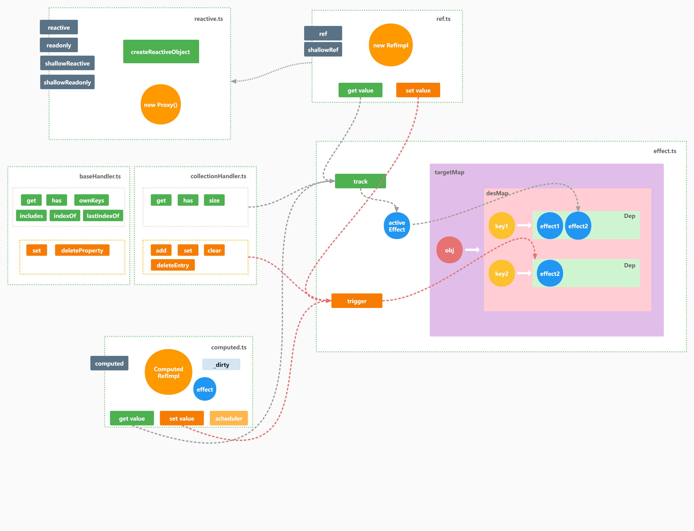

# Vue3 的响应式原理

> Vue 最独特的特性之一，是其非侵入性的响应性系统。数据模型是被代理的 JavaScript 对象。而当你修改它们时，视图会进行更新。

Vue 的响应式系统是 Vue 最核心的部分，下面我们一起来了解下响应式系统是怎么实现的吧。

### 什么是响应式？

在介绍响应式原理之前，我想先介绍下什么是响应式。一个最简单的例子是：

现在存在两个变量 `a`和 `b`，然后还有一个变量来表示他们的和 `sum`。当 `a` 或者 `b` 的值变化时，`sum` 的值也会自动变为 a 和 b 的和。

将上面的描述翻译成代码：

```javascript
let a = 1
let b = 1
let sum = a + b

console.log(sum) // => 2

b = 2
consolel.log(sum) // => 2，这里我们希望 sum 的值应该是 3，但是 sum 的值并没有自动变更
```

怎么样才能实现 sum 的值自动变成 a 和 b 两者之和呢？

就是在我们给 b 赋值的时候，再去计算下 a + b 的值，然后赋值给 sum 这个变量。重新计算 a + b 的值，这个动作实际上可以抽象为一个函数。那么我们很容易写出下面的代码：

```javascript
let a = 1
let b = 1
let sum

const fn = () => {
  sum = a + b
}
fn()

console.log(sum) // => 2

b = 2
fn()

consolel.log(sum) // => 3
```

当 b 的值改变的时候，只需要重新运行下 fn 这个函数，就可以保证 sum 的值是正确的了。

要想自动重新运行 fn 这个函数，首先我们要在函数 fn 和变量 a b 之间建立一个依赖关系。

这样当 b 改变时，我们就知道需要重新执行函数 fn 了。

总结下，实现响应式需要做到一下几点：

1. 当一个值被读取时进行追踪，比如 fn 函数中读取了 a 和 b 两个变量
2. 当某个值改变时进行检测，比如修改 b 的值为 2
3. 重新运行代码来读取原始值，比如重新运行 fn 函数

## 响应式原理

想要做到上面的三点，我们需要具备下面两个能力：

1. 需要知道变量什么时候被赋值，什么时候被读取？
2. 知道需要当前正在运行的是哪个函数？

对于第一点，Es6 提供了新的语法 [Proxy](https://developer.mozilla.org/zh-CN/docs/Web/JavaScript/Reference/Global_Objects/Proxy)。Proxy 是一个对象，它包装了另一个对象，并允许你拦截对该对象的任何交互。

```js
const p = new Proxy(target, handler)
```
handler 中的 get 和 set 属性可以检测到对该对象属性的读取和赋值。

```js
const obj = {
  foo: 'foo'
}

const handler = {
  get(target, property, receiver) {
    track(target, property) // 这里进行收集
    return Reflect.get(...arguments)
  },
  set(target, property, value, receiver) {
    trigger(target, property) // 这里触发相关函数重新执行
    return Reflect.set(...arguments)
  }
}

const proxy = new Proxy(obj, handler)
console.log(proxy.foo)
```

同时 Proxy 一般和 Reflect 一起使用将对代理对象的操作反射回源对象，主要是为了方便处理源对象上 getter 和 setter 的 this 指向问题。

Proxy 很强大，但是它只能代理对象，那么对于基础类型怎么监听它的读取和变化呢？

Vue3 通过 RefImpl 这个类包裹原始值，通过实例的 get 和 set 方法劫持对于原始数据的更改。所以本质上还是通过 Object.defineProperty 来实现响应式。

```ts
class RefImpl<T> {
  private _value: T
  /* ... */
  constructor(value: T, public readonly _shallow: boolean) {
    /* ... */
    this._value = _shallow ? value : toReactive(value)
  }
  get value() {
    trackRefValue(this) // 在这里进行收集
    return this._value
  }
  set value(newVal) {
    /* ... */
    triggerRefValue(this, newVal) // 这里调用相关函数重新执行
  }
}
```

对于第二点，我们可以使用高阶函数的概念，包裹指定的函数，再用一个全局变量保存该函数。类型与下面的代码：

```javascript
let activeFunction;

const effect = (fn) => {
  return (...args) => {
    try {
      activeFunction = fn;
      return fn(...args);
    } finally {
      activeFunction = undefined;
    }
  };
};

const effectFoo = effect(function foo () {
  console.log("foo"); // 这里的 activeFunction 就是 foo
});

const effectBar = effect(function bar () {
  console.log("bar"); // 这里的 activeFunction 就是 bar
});
```

现在我们有了这两个能力就可以实现响应式了，下面我们来分析源码。

## 源码分析

在分析源码之前我们先看下 Vue3 的响应式是怎么使用的：

```js
const { reactive, effect } = VueReactivity

const proxy = reactive({
  name: 'origin value'
})

effect(() => {
  console.log('proxy -> name:', proxy.name)
})

// proxy -> name: origin value

proxy.name = 'changed value'
// proxy -> name: changed value
```

与响应式相关的代码放在 /packages/reactivity 下。下面我们主要关注这个模块下的代码。

点开之后可以看到模块的目录结构如下图所示：

主要关注点的模块是：

+ reactive：是用来代理指定的对象，使其变成响应式的。
+ baseHandler：定义对象的 get 和 set 等方法。
+ effect：包裹一个函数，当该函数内部使用的响应式数据发生改变时，改函数会自动重新运行。

```
reactivity
├── api-extractor.json          # 模块 api 的描述
├── index.js                    # commonjs 下导出模块，并且导出的是编译好的模块
├── LICENSE
├── package.json
├── README.md
├── src
│   ├── baseHandlers.ts         # 一般数据类型的处理器
│   ├── collectionHandlers.ts   # 集合类型数据的处理器
│   ├── computed.ts             # 计算属性相关
│   ├── deferredComputed.ts
│   ├── dep.ts                  # 依赖管理
│   ├── effect.ts               # 副作用函数
│   ├── effectScope.ts
│   ├── index.ts                # 模块入口，导出方法
│   ├── operations.ts           # 操作类型的静态配置
│   ├── reactive.ts             # 对象的响应式相关
│   ├── ref.ts                  # 基础类型的相应式
│   └── warning.ts
```

响应式相关的逻辑可以用下面的图描述：



先分析下响应式数据和对应的副作用函数之间的关系是怎么存储的。

在 effect 模块的全局作用域下会有一个 targetMap 这个对象，它是一个 WeakMap，键是目标对象，值是一个 desMap。

depsMap 是一个 Map，它的键是目标对象的属性名，值是一个依赖集合(Set)。

当某个副作用函数读取了响应式对象的属性，这个副作用函数就会被放置在对应的依赖集合中。

### 模块概述

**reactive**

这个模块暴露了 reactive shallowReactive readonly shallowReadonly 四个响应式相关的方法，然后这四个方法都会调用 createReactiveObject 这个方法，然后由内部去调用 new Proxy() 并判断使用哪种处理函数。

还有一点需要注意的是，reactive 模块有个全局缓存，当对象被代理过之后，就直接返回缓存中的对象，避免对一个对象重复代理。

```ts
export function reactive(target: object) {
  // if trying to observe a readonly proxy, return the readonly version.
  if (target && (target as Target)[ReactiveFlags.IS_READONLY]) {
    return target
  }
  return createReactiveObject(
    target,
    false,
    mutableHandlers,
    mutableCollectionHandlers,
    reactiveMap
  )
}

function createReactiveObject(
  target: Target,
  isReadonly: boolean,
  baseHandlers: ProxyHandler<any>,
  collectionHandlers: ProxyHandler<any>,
  proxyMap: WeakMap<Target, any>
) {
  if (!isObject(target)) {
    if (__DEV__) {
      console.warn(`value cannot be made reactive: ${String(target)}`)
    }
    return target
  }
  // 如果对象已经被代理了，就直接返回
  if (
    target[ReactiveFlags.RAW] &&
    !(isReadonly && target[ReactiveFlags.IS_REACTIVE])
  ) {
    return target
  }
  // 如果对象在缓存中，直接返回
  const existingProxy = proxyMap.get(target)
  if (existingProxy) {
    return existingProxy
  }
  // 只有可以被代理的对象才会被代理 Object Array Map Set WeakMap WeakSet
  const targetType = getTargetType(target)
  if (targetType === TargetType.INVALID) {
    return target
  }
  const proxy = new Proxy(
    target,
    targetType === TargetType.COLLECTION ? collectionHandlers : baseHandlers
  )
  proxyMap.set(target, proxy)
  return proxy
}
```

**handler**

以 baseHandler 为例，handler 这个模块主要的功能是：实现属性的get，set等方法，并且在恰当时机调用收集(track)和触发(trigger)方法。

```ts
// 返回了 Getter 函数
function createGetter(isReadonly = false, shallow = false) {
  return function get(target: Target, key: string | symbol, receiver: object) {
    /* ... */

    const targetIsArray = isArray(target)

    // 劫持了数组的一些方法 includes indexOf lastIndexOf push pop shift unshift splice
    if (!isReadonly && targetIsArray && hasOwn(arrayInstrumentations, key)) {
      return Reflect.get(arrayInstrumentations, key, receiver)
    }

    const res = Reflect.get(target, key, receiver)

    if (isSymbol(key) ? builtInSymbols.has(key) : isNonTrackableKeys(key)) {
      return res
    }

    if (!isReadonly) { // 只读的代理对象不会收集相关的依赖
      // 最主要的逻辑在这里
      // 这里会将当前对象和使用这个对象的 effect 函数（如果有的话）建立一层联系，并保存到全局变量 targetMap 中
      track(target, TrackOpTypes.GET, key)
    }

    if (shallow) { // 浅代理模式下不会递归代理内部的对象
      return res
    }

    /* ... */

    // 响应式对象的子对象也会是响应式的
    if (isObject(res)) {
      return isReadonly ? readonly(res) : reactive(res)
    }

    return res
  }
}

function createSetter(shallow = false) {
  return function set(
    target: object,
    key: string | symbol,
    value: unknown,
    receiver: object
  ): boolean {
    let oldValue = (target as any)[key]
    /* ... */

    const hadKey =
      isArray(target) && isIntegerKey(key)
        ? Number(key) < target.length
        : hasOwn(target, key)
    // 反射修改
    const result = Reflect.set(target, key, value, receiver)
    // don't trigger if target is something up in the prototype chain of original
    // 只有修改到当前对象上的属性才需要触发更新，修改原型链上的不需要
    if (target === toRaw(receiver)) {
      if (!hadKey) {
        // 当前对象不存在的该 key 值时，标记为添加模式
        trigger(target, TriggerOpTypes.ADD, key, value)
      } else if (hasChanged(value, oldValue)) { // 只有值变化了才触发更新
        trigger(target, TriggerOpTypes.SET, key, value, oldValue)
      }
    }
    return result
  }
}
```

**effect**

effect 内部创建了一个 ReactiveEffect 实例，并默认调用实例的 run 方法。

```ts
export function effect<T = any>(
  fn: () => T,
  options?: ReactiveEffectOptions
): ReactiveEffectRunner {
  // ...
  // 创建一个 reactive effect 实例
  const _effect = new ReactiveEffect(fn)
  // ...
  // 创建 effect 时只要不是 lazy 模式，就会立即执行 effect 包裹的函数
  if (!options || !options.lazy) {
    _effect.run()
  }

  // 向外抛出一个 runner 函数
  // 调用 runner 函数等于调用内部 effect 实例的 run 方法
  const runner = _effect.run.bind(_effect) as ReactiveEffectRunner
  runner.effect = _effect
  return runner
}
```

run 方法内部会将 activeEffect 这个全局变量赋值为传入的函数，然后再调用这个函数。

调用原始函数时，原始函数中如果读取了响应式的数据，就会触发 track 方法。

```ts
export class ReactiveEffect<T = any> {
  // ...
  run() {
    // ...
    try {
      activeEffect = this
      // ...
      return this.fn()
    } finally {
      // ...
      activeEffect = undefined
    }
  }
  // ...
}
```

**track**

tack 方法主要的作用就是把 activeEffect 放到对应的 Deps 当中。这里需要注意的是，把 activeEffect 放到 Deps 当中之后，effect 会有个属性 deps 同样指向对应的 Deps。这么做是因为每次收集前都需要将 activeEffect 从整个依赖关系中删除，以保证新收集到的依赖关系是准确的。如果全量查找的效率太低，最好是构建一个双向指针。
```ts
export function track(target: object, type: TrackOpTypes, key: unknown) {
  if (shouldTrack && activeEffect) {
    let depsMap = targetMap.get(target)
    if (!depsMap) {
      targetMap.set(target, (depsMap = new Map()))
    }
    let dep = depsMap.get(key)
    if (!dep) {
      depsMap.set(key, (dep = createDep()))
    }

    const eventInfo = __DEV__
      ? { effect: activeEffect, target, type, key }
      : undefined

    trackEffects(dep, eventInfo)
  }
}

export function trackEffects(
  dep: Dep,
  debuggerEventExtraInfo?: DebuggerEventExtraInfo
) {
  let shouldTrack = false
  if (effectTrackDepth <= maxMarkerBits) {
    if (!newTracked(dep)) { //如果当前的 effect 还没有被打过标记
      // 在这里给这个 Dep 打上一个标记
      dep.n |= trackOpBit // set newly tracked
      shouldTrack = !wasTracked(dep) // 之前没有标记过，那么就需要重新收集下
    }
  } else {
    // Full cleanup mode.
    shouldTrack = !dep.has(activeEffect!)
  }

  if (shouldTrack) {
    dep.add(activeEffect!)
    // 为什么要将当前的 dep 保存到 activeEffect 的 deps 中？
    // 这里其实是做了一个双向指针，通过属性可以找到相关 effects 的集合，通过某个 effect 可以找到它属于哪些 Dep 集合
    // 在 effect 每次运行前都需要从整个依赖关系树中删除掉当前 effect，当 effect 重新执行后又会将当前的 effect 重新塞到对于的 Dep 里
    // 为了方便处理，最好是知道有哪些 Dep 使用到了当前的 effect，所以需要在 effect 当中设置变量 deps，用来表示有哪些 Dep 包含当前 effect
    activeEffect!.deps.push(dep)
    if (__DEV__ && activeEffect!.onTrack) {
      activeEffect!.onTrack(
        Object.assign(
          {
            effect: activeEffect!
          },
          debuggerEventExtraInfo
        )
      )
    }
  }
}
```

**trigger**

trigger 主要做的是从依赖关系树中拿到要执行的副作用函数，并循环调用他们的 run 方法。

```ts
export function trigger(
  target: object,
  type: TriggerOpTypes,
  key?: unknown,
  newValue?: unknown,
  oldValue?: unknown,
  oldTarget?: Map<unknown, unknown> | Set<unknown>
) {
  const depsMap = targetMap.get(target)
  if (!depsMap) {
    // never been tracked
    return
  }

  let deps: (Dep | undefined)[] = []
  // ...
  if (key !== void 0) {
    // 从依赖关系树中拿到对应的 Deps
    deps.push(depsMap.get(key))
  }
  // ...
  const effects: ReactiveEffect[] = []
  // 得到要执行的副作用函数
  for (const dep of deps) {
    if (dep) {
      effects.push(...dep)
    }
  }
  if (__DEV__) {
    triggerEffects(createDep(effects), eventInfo)
  } else {
    triggerEffects(createDep(effects))
  }
}

export function triggerEffects(
  dep: Dep | ReactiveEffect[],
  debuggerEventExtraInfo?: DebuggerEventExtraInfo
) {
  for (const effect of isArray(dep) ? dep : [...dep]) {
    if (effect !== activeEffect || effect.allowRecurse) {
      // ...
      if (effect.scheduler) {
        effect.scheduler()
      } else {
        effect.run()
      }
    }
  }
}

```

### 一些优化

每当effect再次执行的时候，都要先将上一次收集过的清空掉，重新进行收集，这么做的目的其实是为了避免上一次收集到的依赖，本次不需要去收集的情况所导致的依赖收集错误

但是大部分场景中依赖的变动其实是相对较小的，并不需要如此大刀阔斧的进行全部清空，再次收集。

Vue3 这里使用了位掩码来标记依赖是否需要被删除。思路是在 fn 这个函数运行前给每个 dep 打上一个标记，运行时做一点记号，运行结束后没有记号的就需要被删除

第一步：在 fn 函数运行前，给含有当前 effect 的 dep 打上标记。

```ts
export class ReactiveEffect<T = any> {
  run() {
    // ...
    try {
      this.parent = activeEffect
      activeEffect = this
      shouldTrack = true

      // 标记 effect 层级
      trackOpBit = 1 << ++effectTrackDepth

      if (effectTrackDepth <= maxMarkerBits) {
        // 在 fn 函数运行前，给含有当前 effect 的 dep 打上标记，用 w 变量来存储
        initDepMarkers(this)
      } else {
        // 全量重置依赖
        // 当调用下面的 this.fn() 之后，会触发 getter 并将当前的 effect 重新添加到 fn 中使用到的变量对应的 deps 里
        cleanupEffect(this)
      }
      return this.fn()
    } finally {
      // ...
    }
  }
}

export const initDepMarkers = ({ deps }: ReactiveEffect) => {
  if (deps.length) {
    for (let i = 0; i < deps.length; i++) {
      // 打上新标记
      deps[i].w |= trackOpBit // set was tracked
    }
  }
```

第二步：在收集的时候给当前 Dep 上打上新标记。

```ts
export function trackEffects(
  dep: Dep,
  debuggerEventExtraInfo?: DebuggerEventExtraInfo
) {
  let shouldTrack = false
  if (effectTrackDepth <= maxMarkerBits) {
    if (!newTracked(dep)) { //如果当前的 effect 还没有被打过标记
      // 在这里给这个 Dep 打上一个标记
      dep.n |= trackOpBit // set newly tracked
      shouldTrack = !wasTracked(dep) // 之前没有标记过，那么就需要重新收集下
    }
  } else {
    // Full cleanup mode.
    shouldTrack = !dep.has(activeEffect!)
  }
}
```

第三步：fn 执行完之后，看下当前 effect 对应的 Dep 中，有哪些是之前被标记了，但是这次没有被标记，则需要删除从 Dep 中将该 effect 删除。

```ts
export class ReactiveEffect<T = any> {
  run() {
    // ...
    try {
      // ...
      return this.fn()
    } finally {
      if (effectTrackDepth <= maxMarkerBits) {
        // 执行完 effect，看下需要删除哪些依赖，需要添加哪些依赖
        finalizeDepMarkers(this)
      }

      trackOpBit = 1 << --effectTrackDepth

      activeEffect = this.parent
      shouldTrack = lastShouldTrack
      this.parent = undefined
    }
  }
}

export const finalizeDepMarkers = (effect: ReactiveEffect) => {
  const { deps } = effect
  if (deps.length) {
    let ptr = 0
    for (let i = 0; i < deps.length; i++) {
      const dep = deps[i]
      if (wasTracked(dep) && !newTracked(dep)) {
        // 之前收集到了，这次没有 需要删除掉自己
        dep.delete(effect)
      } else {
        deps[ptr++] = dep
      }
      // clear bits
      // 重置标记 先按位取反，再取并集
      dep.w &= ~trackOpBit
      dep.n &= ~trackOpBit
    }
    deps.length = ptr
  }
}
```

### ref

ref 用来处理非对象类型的数据，它本质上是利用对象的 get 和 set 方法，劫持数据的读写再调用 track 和 trigger 方法。
需要注意的是，ref 的依赖关系是存放在实例的 dep 属性下的。

```ts
export function ref(value?: unknown) {
  return createRef(value, false)
}
function createRef(rawValue: unknown, shallow: boolean) {
  if (isRef(rawValue)) {
    return rawValue
  }
  return new RefImpl(rawValue, shallow)
}
class RefImpl<T> {
  private _value: T
  private _rawValue: T

  public dep?: Dep = undefined
  public readonly __v_isRef = true

  constructor(value: T, public readonly __v_isShallow: boolean) {
    this._rawValue = __v_isShallow ? value : toRaw(value)
    this._value = __v_isShallow ? value : toReactive(value)
  }

  get value() {
    trackRefValue(this)
    return this._value
  }

  set value(newVal) {
    newVal = this.__v_isShallow ? newVal : toRaw(newVal)
    if (hasChanged(newVal, this._rawValue)) {
      this._rawValue = newVal
      this._value = this.__v_isShallow ? newVal : toReactive(newVal)
      triggerRefValue(this, newVal)
    }
  }
}
```

### computed

computed 内部包含一个有自定义调度器的 effect 函数，还有一个内部变量 _dirty 来控制是否需要重新计算当前计算属性的值。

```ts
export class ComputedRefImpl<T> {
  public dep?: Dep = undefined

  private _value!: T
  public readonly effect: ReactiveEffect<T>

  public readonly __v_isRef = true
  public readonly [ReactiveFlags.IS_READONLY]: boolean

  public _dirty = true
  public _cacheable: boolean

  constructor(
    getter: ComputedGetter<T>,
    private readonly _setter: ComputedSetter<T>,
    isReadonly: boolean,
    isSSR: boolean
  ) {
    this.effect = new ReactiveEffect(getter, () => {
      if (!this._dirty) {
        this._dirty = true
        triggerRefValue(this)
      }
    })
    this.effect.computed = this
    this.effect.active = this._cacheable = !isSSR
    this[ReactiveFlags.IS_READONLY] = isReadonly
  }

  get value() {
    // the computed ref may get wrapped by other proxies e.g. readonly() #3376
    const self = toRaw(this)
    trackRefValue(self)
    if (self._dirty || !self._cacheable) {
      self._dirty = false
      self._value = self.effect.run()!
    }
    return self._value
  }

  set value(newValue: T) {
    this._setter(newValue)
  }
}
```

## 总结

最后总结下：Vue3的响应式核心是抽象出了 effect 函数这个概念，使得响应式实际上就等于 effect 函数的重新调用。
使用 Proxy 代理对象，使用 class 的 get 和 set 劫持基本数据类型。
最后维护 effect 函数和 Dep 之间的关系。