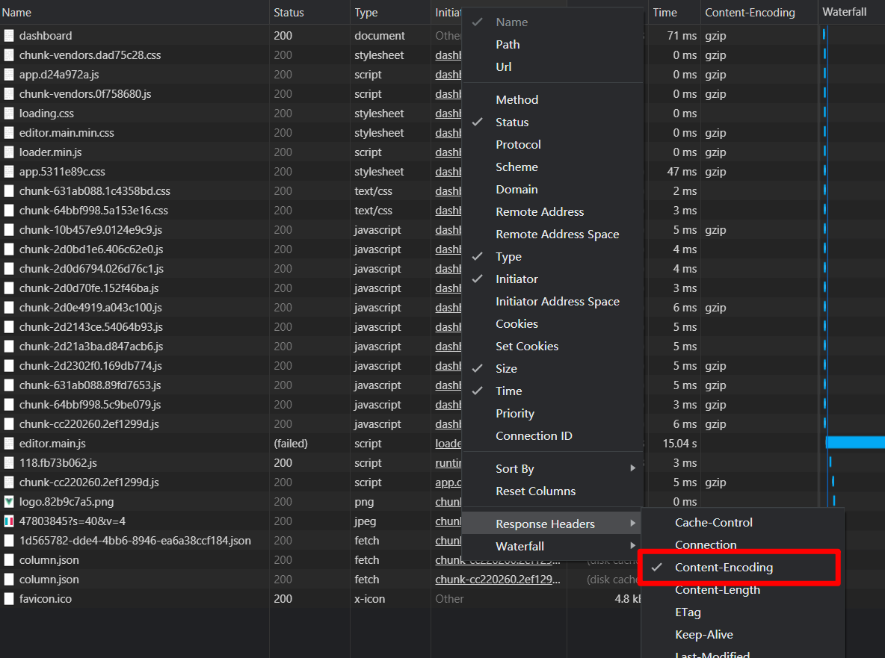
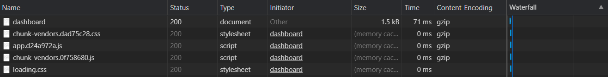

# 前端优化-开启Gzip压缩

## Gzip

> Gzip 是一种用于文件压缩与解压缩的文件格式。它基于 Deflate 算法，可将文件快速地、流式地压缩，从而实现更快的网络传输。 Web服务器与现代浏览器普遍地支持 Gzip，这意味着服务器可以在发送文件之前自动使用 Gzip 压缩文件，而浏览器可以在接收文件时自行解压缩文件。

DEFLATE是[LZ77](https://zh.wikipedia.org/wiki/LZ77与LZ78)与[哈夫曼编码](https://zh.wikipedia.org/wiki/哈夫曼编码)的一个组合体。通常gzip仅用来压缩单个文件。多个文件的压缩归档通常是首先将这些文件合并成一个[tar](https://zh.wikipedia.org/wiki/Tar_(计算机科学))文件，然后再使用gzip进行压缩，最后生成的`.tar.gz`或者`.tgz`文件就是所谓的“tar压缩包”或者“tarball”。

注意不要将gzip和[ZIP](https://zh.wikipedia.org/wiki/ZIP_(文件格式))压缩格式混淆。ZIP也使用DEFLATE算法，而且可移植性更好，不需要一个外部的归档工具就可以包容多个文件。但是，由于ZIP对每个文件进行单独压缩而没有利用文件间的冗余信息（即[固实压缩](https://zh.wikipedia.org/w/index.php?title=固实压缩&action=edit&redlink=1)），所以ZIP的压缩率会稍逊于tar压缩包。

## webpack中开启Gzip

首先，需要安装`compression-webpack-plugin`：

```shell
npm install compression-webpack-plugin --save-dev
```

然后将插件添加到您的`webpack`配置中。例如

```js
// webpack.config.js
module.exports = {
  plugins: [new CompressionPlugin()]
}
```

**注意：compression-webpack-plugin 7 [不再支持 webpack4](https://github.com/webpack-contrib/compression-webpack-plugin/blob/master/CHANGELOG.md)**

配置项：

| Name                 | Type                           | Default                                 | Description                                              |
| -------------------- | ------------------------------ | --------------------------------------- | -------------------------------------------------------- |
| test                 | `{String\|RegExp\|Array}`        | `undefined`                             | 包括所有通过测试断言的资产                               |
| include              | `{String\|RegExp\|Array}`        | `undefined`                             | 包括符合以下任何条件的所有文件                           |
| exclude              | `{String\|RegExp\|Array}`        | `undefined`                             | 排除符合以下任何条件的所有文件                           |
| algorithm            | `{String\|Function}`            | `gzip`                                  | 压缩算法/功能                                            |
| compressionOptions   | `{Object}`                     | gzip的最大可用压缩级别： `{ level: 9 }` | 压缩选项                                                 |
| threshold            | `{Number}`                     | `0`                                     | 仅处理大于此大小的资产（以字节为单位）                   |
| minRatio             | `{Number}`                     | `0.8`                                   | 仅压缩比该比率更好的资产（压缩比 = 压缩后的体积/原体积） |
| filename             | `{String\|Function}`            | `[path][base].gz`                       | 目标资产文件名                                           |
| deleteOriginalAssets | `{Boolean\|'keep-source-map'}`  | `false`                                 | 是否删除原始资产                                         |

开启 Gzip 后，会发现打包后的文件中存在 `.gz` 文件。


## 开启Gzip

### Node.js

node端很简单，只要加上compress模块即可，代码如下

```js
var compression = require('compression')
var app = express()

//尽量在其他中间件前使用compression
app.use(compression());
```

这是基本用法，如果还要对请求进行过滤的话，还要加上

```js
app.use(compression({filter: shouldCompress}))

function shouldCompress (req, res) {
  if (req.headers['x-no-compression']) {
    // 这里就过滤掉了请求头包含'x-no-compression'
    return false
  }

  return compression.filter(req, res)
}
```

更多用法请移步[compression文档](https://github.com/expressjs/compression)
如果用的是koa，用法和上面的差不多

```js
const compress = require('koa-compress')
const app = module.exports = new Koa()
app.use(compress())
```

### Nginx

gzip使用环境:http,server,location,if(x),一般把它定义在nginx.conf的http{…..}之间

- **gzip on**

  on为启用，off为关闭

- **gzip_min_length 1k**

  设置允许压缩的页面最小字节数，页面字节数从header头中的Content-Length中进行获取。默认值是0，不管页面多大都压缩。建议设置成大于1k的字节数，小于1k可能会越压越大。

- **gzip_buffers 4 16k**

  获取多少内存用于缓存压缩结果，‘4 16k’表示以16k*4为单位获得

- **gzip_comp_level 5**

  gzip压缩比（1~9），越小压缩效果越差，但是越大处理越慢，所以一般取中间值;

- **gzip_types text/plain application/x-javascript text/css application/xml text/javascript application/x-httpd-php**

  对特定的MIME类型生效,其中'text/html’被系统强制启用

- **gzip_http_version 1.1**

  识别http协议的版本,早起浏览器可能不支持gzip自解压,用户会看到乱码

- **gzip_vary on**

  启用应答头"Vary: Accept-Encoding"

- **gzip_proxied off**
  
  nginx做为反向代理时启用

  - off 关闭所有代理结果的数据的压缩

  - expired 启用压缩,如果header头中包括"Expires"头信息

  - no-cache 启用压缩,header头中包含"Cache-Control:no-cache"

  - no-store 启用压缩,header头中包含"Cache-Control:no-store"

  - private 启用压缩,header头中包含"Cache-Control:private"

  - no_last_modefied 启用压缩,header头中不包含"Last-Modified"

  - no_etag 启用压缩,如果header头中不包含"Etag"头信息

  - auth 启用压缩,如果header头中包含"Authorization"头信息

- **gzip_disable msie6**

  (IE5.5和IE6 SP1使用msie6参数来禁止gzip压缩 )
  
  指定哪些不需要gzip压缩的浏览器(将和User-Agents进行匹配),依赖于PCRE库

以上代码可以插入到 http {...}整个服务器的配置里，也可以插入到虚拟主机的 server {...}或者下面的location模块内

### 查看是否成功使用Gzip压缩文件

不是每个浏览器都支持gzip，如何知道客户端是否支持gzip呢，请求头中有个Accept-Encoding来标识对压缩的支持。客户端http请求头声明浏览器支持的压缩方式，服务端配置启用压缩，压缩的文件类型，压缩方式。当客户端请求到服务端的时候，服务器解析请求头，如果客户端支持gzip压缩，响应时对请求的资源进行压缩并返回给客户端，浏览器按照自己的方式解析，在http响应头，我们可以看到 content-encoding:gzip，这是指服务端使用了gzip的压缩方式。

如果发现 Network 中没有 Content-Encoding 字段，可以 右键表头 > Response Headers > Conten-Encoding，打开此选项。




